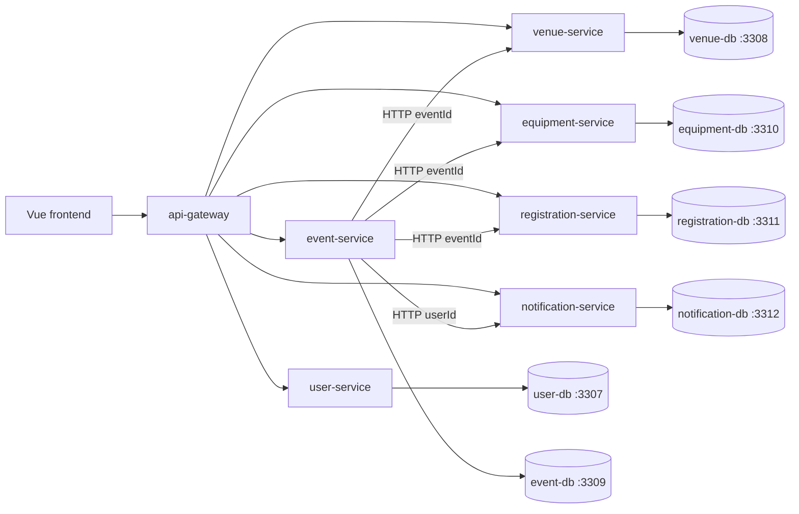
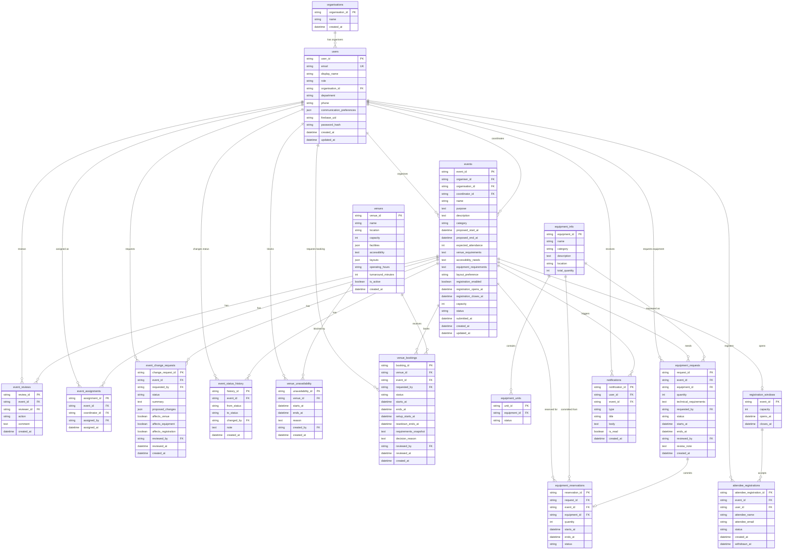

# ConnectSphere Data Model

Database-per-service relational model for the Week 12 core features. MySQL 8.4 runs locally in Docker Compose. Services never join across databases; they share IDs over HTTP. Cross-service keys (`event_id`, `user_id`, `venue_id`, `equipment_id`) are **logical foreign keys** only.

Column names in MySQL are **snake_case**. API JSON stays **camelCase**. SQLAlchemy maps between them.

Out of scope for this schema: programme/sessions, comments, documents, reports, technical-staff assignment.

## Service to database

| Service | Database | Host port |
|---|---|---|
| user-service | `user` | 3307 |
| event-service | `event` | 3309 |
| venue-service | `venue` | 3308 |
| equipment-service | `equipment` | 3310 |
| registration-service | `registration` | 3311 |
| notification-service | `notification` | 3312 |

---

## 1. user-service (`user`)

### organisations

Lightweight client record. Multiple event organisers may belong to the same organisation.

| Column | Type | Notes |
|---|---|---|
| organisation_id | VARCHAR(64) PK | |
| name | VARCHAR(255) | |
| created_at | DATETIME | |

### users

| Column | Type | Notes |
|---|---|---|
| user_id | VARCHAR(64) PK | |
| email | VARCHAR(255) unique | Login username |
| display_name | VARCHAR(255) | |
| role | VARCHAR(64) | See roles below |
| organisation_id | VARCHAR(64) nullable | FK → organisations |
| department | VARCHAR(255) nullable | Internal staff |
| phone | VARCHAR(64) nullable | |
| communication_preferences | JSON nullable | |
| firebase_uid | VARCHAR(128) nullable | Auth later |
| password_hash | VARCHAR(255) | Local demo until Firebase |
| created_at | DATETIME | |
| updated_at | DATETIME | |

**Roles** (stored values match the existing frontend session keys):

- `organiser` — Event Organiser
- `coordinator` — Event Coordinator
- `venue` — Venue Staff
- `techsupport` — Technical Support Staff
- `attendee` — Attendee

---

## 2. event-service (`event`)

Orchestrator. Owns the event request record, review, assignment, change requests, and status history.

### events

Draft vs submitted is `status`, not a separate table.

| Column | Type | Notes |
|---|---|---|
| event_id | VARCHAR(64) PK | |
| organiser_id | VARCHAR(64) | Logical FK → users |
| organisation_id | VARCHAR(64) nullable | Logical FK → organisations |
| coordinator_id | VARCHAR(64) nullable | Logical FK → users; null until assigned |
| name | VARCHAR(255) | |
| purpose | TEXT | |
| description | TEXT | |
| category | VARCHAR(64) nullable | |
| proposed_start_at | DATETIME | |
| proposed_end_at | DATETIME | |
| expected_attendance | INT | |
| venue_requirements | TEXT | |
| accessibility_needs | TEXT | |
| equipment_requirements | TEXT | |
| layout_preference | VARCHAR(64) nullable | |
| registration_enabled | BOOLEAN | |
| registration_opens_at | DATETIME nullable | |
| registration_closes_at | DATETIME nullable | |
| capacity | INT | Intended registration cap |
| status | VARCHAR(32) | See statuses below |
| submitted_at | DATETIME nullable | |
| created_at | DATETIME | |
| updated_at | DATETIME | |

**Event status:** `draft` | `submitted` | `under_review` | `clarification_requested` | `approved` | `planning` | `confirmed` | `rejected` | `cancelled` | `completed`

Ordinary edits (description, purpose) update `events` directly. Date, attendance, venue/equipment requirements go through `event_change_requests` after submit so existing bookings can be re-checked.

### event_reviews

| Column | Type | Notes |
|---|---|---|
| review_id | VARCHAR(64) PK | |
| event_id | VARCHAR(64) | FK → events |
| reviewer_id | VARCHAR(64) | Logical FK → users |
| action | VARCHAR(32) | `request_clarification` \| `approve` \| `reject` |
| comment | TEXT | |
| created_at | DATETIME | |

### event_assignments

Coordinator assign / reassign history.

| Column | Type | Notes |
|---|---|---|
| assignment_id | VARCHAR(64) PK | |
| event_id | VARCHAR(64) | FK → events |
| coordinator_id | VARCHAR(64) | Logical FK → users |
| assigned_by | VARCHAR(64) | Logical FK → users |
| assigned_at | DATETIME | |

### event_change_requests

| Column | Type | Notes |
|---|---|---|
| change_request_id | VARCHAR(64) PK | |
| event_id | VARCHAR(64) | FK → events |
| requested_by | VARCHAR(64) | Logical FK → users |
| status | VARCHAR(32) | `pending` \| `approved` \| `rejected` \| `applied` |
| summary | TEXT | |
| proposed_changes | JSON | Field diffs |
| affects_venue | BOOLEAN | |
| affects_equipment | BOOLEAN | |
| affects_registration | BOOLEAN | |
| reviewed_by | VARCHAR(64) nullable | |
| reviewed_at | DATETIME nullable | |
| created_at | DATETIME | |

### event_status_history

| Column | Type | Notes |
|---|---|---|
| history_id | VARCHAR(64) PK | |
| event_id | VARCHAR(64) | FK → events |
| from_status | VARCHAR(32) nullable | |
| to_status | VARCHAR(32) | |
| changed_by | VARCHAR(64) | Logical FK → users |
| note | TEXT | |
| created_at | DATETIME | |

---

## 3. venue-service (`venue`)

### venues

JSON arrays (`facilities`, `layouts`) are filterable in MySQL 8 with `JSON_CONTAINS`.

| Column | Type | Notes |
|---|---|---|
| venue_id | VARCHAR(64) PK | |
| name | VARCHAR(255) | |
| location | VARCHAR(255) | |
| capacity | INT | |
| facilities | JSON | Array of strings |
| accessibility | TEXT | |
| layouts | JSON | Array of strings |
| operating_hours | VARCHAR(255) | |
| turnaround_minutes | INT | |
| is_active | BOOLEAN | |

### venue_unavailability

Needed by the availability calendar (maintenance, blocked periods).

| Column | Type | Notes |
|---|---|---|
| unavailability_id | VARCHAR(64) PK | |
| venue_id | VARCHAR(64) | FK → venues |
| starts_at | DATETIME | |
| ends_at | DATETIME | |
| reason | TEXT | |
| created_by | VARCHAR(64) | Logical FK → users |

### venue_bookings

| Column | Type | Notes |
|---|---|---|
| booking_id | VARCHAR(64) PK | |
| venue_id | VARCHAR(64) | FK → venues |
| event_id | VARCHAR(64) | Logical FK → events |
| requested_by | VARCHAR(64) | Logical FK → users |
| status | VARCHAR(32) | `pending` \| `approved` \| `rejected` \| `cancelled` |
| starts_at | DATETIME | Event window start |
| ends_at | DATETIME | Event window end |
| setup_starts_at | DATETIME | Window expanded by turnaround |
| teardown_ends_at | DATETIME | Window expanded by turnaround |
| requirements_snapshot | TEXT | |
| decision_reason | TEXT nullable | |
| reviewed_by | VARCHAR(64) nullable | |
| reviewed_at | DATETIME nullable | |
| created_at | DATETIME | |

Index: `(venue_id, starts_at, ends_at)`.

**Conflict rule:** two rows for the same `venue_id` with status in (`pending`, `approved`) must not overlap on `[setup_starts_at, teardown_ends_at)`. Enforce in venue-service (query + transaction), not a cross-DB constraint.

**Suitability rule** (application, not a table): `expected_attendance <= capacity`, required facilities ⊆ venue facilities, requested layout in supported layouts, requested window inside operating hours, no conflict.

---

## 4. equipment-service (`equipment`)

Quantity-based availability. Units exist so individual items can be marked damaged or in maintenance.

### equipment_info

| Column | Type | Notes |
|---|---|---|
| equipment_id | VARCHAR(64) PK | |
| name | VARCHAR(255) | |
| category | VARCHAR(64) | |
| description | TEXT | |
| location | VARCHAR(255) | |
| total_quantity | INT | |

### equipment_units

| Column | Type | Notes |
|---|---|---|
| unit_id | VARCHAR(64) PK | |
| equipment_id | VARCHAR(64) | FK → equipment_info |
| status | VARCHAR(32) | `available` \| `maintenance` \| `damaged` |

### equipment_requests

| Column | Type | Notes |
|---|---|---|
| request_id | VARCHAR(64) PK | |
| event_id | VARCHAR(64) | Logical FK → events |
| equipment_id | VARCHAR(64) | FK → equipment_info |
| quantity | INT | |
| technical_requirements | TEXT | |
| requested_by | VARCHAR(64) | Logical FK → users |
| status | VARCHAR(32) | `pending` \| `approved` \| `rejected` \| `cancelled` |
| starts_at | DATETIME | Copied from the event window |
| ends_at | DATETIME | |
| reviewed_by | VARCHAR(64) nullable | |
| review_note | TEXT | |
| created_at | DATETIME | |

### equipment_reservations

Created when a request is approved. Released when the event is cancelled or the request is withdrawn.

| Column | Type | Notes |
|---|---|---|
| reservation_id | VARCHAR(64) PK | |
| request_id | VARCHAR(64) | FK → equipment_requests |
| event_id | VARCHAR(64) | Logical FK → events |
| equipment_id | VARCHAR(64) | FK → equipment_info |
| quantity | INT | |
| starts_at | DATETIME | |
| ends_at | DATETIME | |
| status | VARCHAR(32) | `active` \| `released` |

**Availability:** `total_quantity - count(units in maintenance/damaged) - sum(active overlapping reservations)`.

---

## 5. registration-service (`registration`)

Event-service owns whether registration is enabled and the intended capacity/window. Registration-service owns actual sign-ups so capacity checks are transactional in one DB.

### registration_windows

One per event, created when the event is confirmed / registration is enabled.

| Column | Type | Notes |
|---|---|---|
| event_id | VARCHAR(64) PK | Logical FK → events; unique |
| capacity | INT | |
| opens_at | DATETIME | |
| closes_at | DATETIME | |

### attendee_registrations

| Column | Type | Notes |
|---|---|---|
| attendee_registration_id | VARCHAR(64) PK | |
| event_id | VARCHAR(64) | Logical FK → events |
| user_id | VARCHAR(64) nullable | Logical FK → users |
| attendee_name | VARCHAR(255) | |
| attendee_email | VARCHAR(255) | |
| status | VARCHAR(32) | `registered` \| `withdrawn` \| `waitlisted` (enum reserved; waitlist UI is later) |
| created_at | DATETIME | |
| withdrawn_at | DATETIME nullable | |

Uniqueness of `(event_id, attendee_email)` among non-withdrawn rows is enforced in the application (MySQL cannot express a partial unique index the same way as PostgreSQL).

**Capacity rule:** `COUNT(status = registered) < capacity` inside a transaction.

---

## 6. notification-service (`notification`)

Other services call notification-service over HTTP after a domain action; they do not write this table themselves.

### notifications

| Column | Type | Notes |
|---|---|---|
| notification_id | VARCHAR(64) PK | |
| user_id | VARCHAR(64) | Logical FK → users |
| event_id | VARCHAR(64) nullable | Logical FK → events |
| type | VARCHAR(64) | e.g. `event_submitted`, `clarification_requested`, `booking_approved` |
| title | VARCHAR(255) | |
| body | TEXT | |
| is_read | BOOLEAN | |
| created_at | DATETIME | |

---

## Logical ERD

Logical model of the whole system (Crow’s foot). Cross-service keys are logical FKs — there is no physical `FOREIGN KEY` across MySQL containers. `users.role` is a disjoint subtype: `organiser` | `coordinator` | `venue` | `techsupport` | `attendee`.

## Schema ownership

Alembic revisions under each service are the source of truth. Docker init SQL only creates empty databases. After `docker compose up -d`, run `python scripts/migrate.py` (upgrade + seed). Do not use `create_all()` as the schema path.
