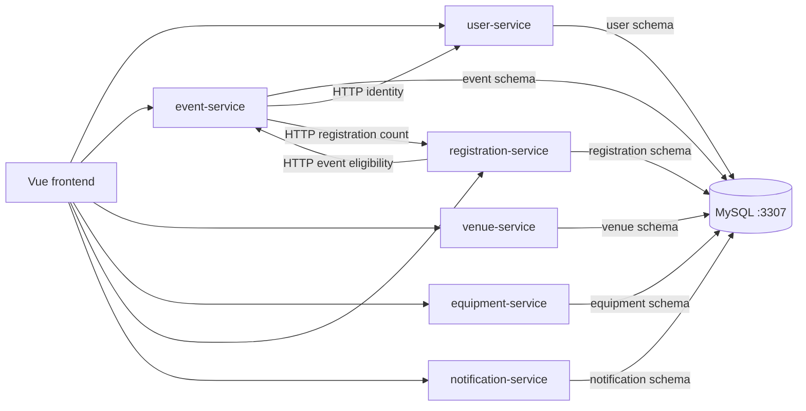
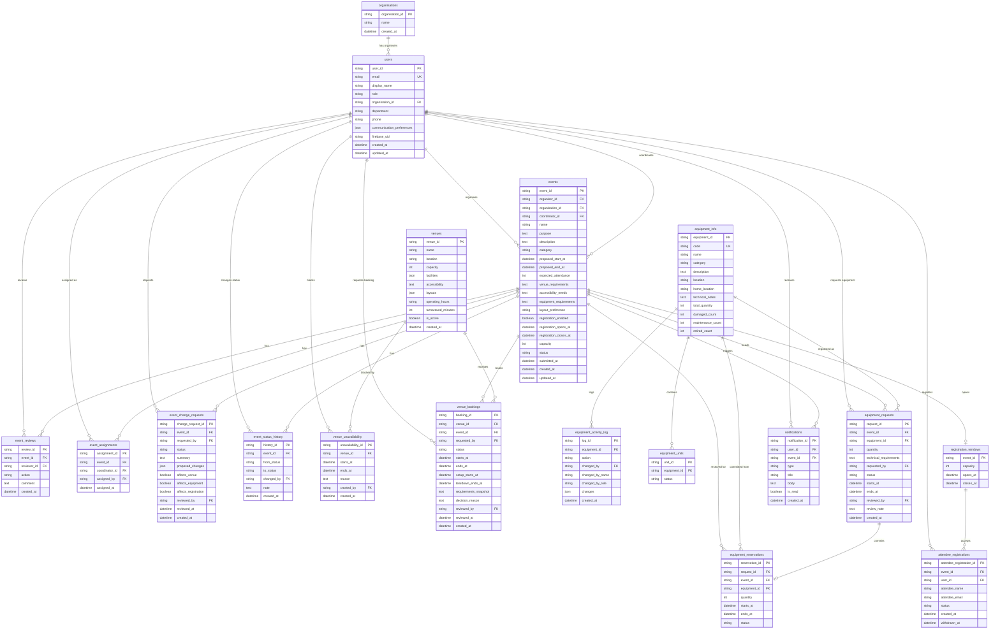

# ConnectSphere Data Model

Schema-per-service relational model for the Week 12 core features. One MySQL 8.4 instance runs locally in Docker Compose and contains six service-owned schemas. Services never join across schemas; they share IDs over HTTP. Cross-service keys (`event_id`, `user_id`, `venue_id`, `equipment_id`) are **logical foreign keys** only.

Column names in MySQL are **snake_case**. API JSON stays **camelCase**. SQLAlchemy maps between them.

Alembic migration heads define the deployed database structure. Status columns are plain `VARCHAR` fields; the listed values describe values currently written or reserved by the model, not database-enforced enums.

Out of scope for this schema: programme/sessions, comments, documents, reports, technical-staff assignment.

## Service to schema

| Service | Schema | Host port |
|---|---|---|
| user-service | `user` | 3307 |
| event-service | `event` | 3307 |
| venue-service | `venue` | 3307 |
| equipment-service | `equipment` | 3307 |
| registration-service | `registration` | 3307 |
| notification-service | `notification` | 3307 |

---

## 1. user-service (`user`)

### organisations

Lightweight client record. Multiple event organisers may belong to the same organisation.

| Column | Type | Notes |
|---|---|---|
| organisation_id | VARCHAR(64) PK | |
| name | VARCHAR(255) | |
| created_at | DATETIME | |

### users

| Column | Type | Notes |
|---|---|---|
| user_id | VARCHAR(64) PK | |
| email | VARCHAR(255) unique | Login username |
| display_name | VARCHAR(255) | |
| role | VARCHAR(64) | See roles below |
| organisation_id | VARCHAR(64) nullable | FK → organisations |
| department | VARCHAR(255) nullable | Internal staff |
| phone | VARCHAR(64) nullable | |
| communication_preferences | JSON nullable | |
| firebase_uid | VARCHAR(128) nullable | Links to the Firebase Auth account |
| created_at | DATETIME | |
| updated_at | DATETIME | |

Authentication is handled by Firebase. The former `password_hash` column was removed by the current user-service migration head.

**Roles** (stored values match the existing frontend session keys):

- `organiser` — Event Organiser
- `coordinator` — Event Coordinator
- `venue` — Venue Staff
- `techsupport` — Technical Support Staff
- `attendee` — Attendee

---

## 2. event-service (`event`)

Owns the event request record, review, assignment, change requests, and status history. The current API creates and reads events, assigns coordinators, resolves organiser identity through user-service, and obtains registration counts from registration-service. Review, status-transition, edit, and change-request APIs are not implemented yet.

### events

Lifecycle state is stored in `status`, not a separate table.

| Column | Type | Notes |
|---|---|---|
| event_id | VARCHAR(64) PK | |
| organiser_id | VARCHAR(64) | Logical FK → users |
| organisation_id | VARCHAR(64) nullable | Logical FK → organisations |
| coordinator_id | VARCHAR(64) nullable | Logical FK → users; null until assigned |
| name | VARCHAR(255) | |
| purpose | TEXT | |
| description | TEXT | |
| category | VARCHAR(64) nullable | |
| proposed_start_at | DATETIME | |
| proposed_end_at | DATETIME | |
| expected_attendance | INT | |
| venue_requirements | TEXT | |
| accessibility_needs | TEXT | |
| equipment_requirements | TEXT | |
| layout_preference | VARCHAR(64) nullable | |
| registration_enabled | BOOLEAN | |
| registration_opens_at | DATETIME nullable | |
| registration_closes_at | DATETIME nullable | |
| capacity | INT | Intended registration cap |
| status | VARCHAR(32) | See statuses below |
| submitted_at | DATETIME nullable | |
| created_at | DATETIME | |
| updated_at | DATETIME | |

**Event status:** the create API currently writes `created`; seed data also uses `planning` and `confirmed`. Other lifecycle values are not validated or transitioned by the current service.

New API-created events have `submitted_at = NULL`. Event editing, submission, and status-history writes are not currently implemented.

### event_reviews

| Column | Type | Notes |
|---|---|---|
| review_id | VARCHAR(64) PK | |
| event_id | VARCHAR(64) | FK → events |
| reviewer_id | VARCHAR(64) | Logical FK → users |
| action | VARCHAR(32) | `request_clarification` \| `approve` \| `reject` |
| comment | TEXT | |
| created_at | DATETIME | |

The table exists in the deployed schema but currently has no router or service workflow.

### event_assignments

Coordinator assign / reassign history.

| Column | Type | Notes |
|---|---|---|
| assignment_id | VARCHAR(64) PK | |
| event_id | VARCHAR(64) | FK → events |
| coordinator_id | VARCHAR(64) | Logical FK → users |
| assigned_by | VARCHAR(64) | Logical FK → users |
| assigned_at | DATETIME | |

### event_change_requests

| Column | Type | Notes |
|---|---|---|
| change_request_id | VARCHAR(64) PK | |
| event_id | VARCHAR(64) | FK → events |
| requested_by | VARCHAR(64) | Logical FK → users |
| status | VARCHAR(32) | `pending` \| `approved` \| `rejected` \| `applied` |
| summary | TEXT | |
| proposed_changes | JSON nullable | Field diffs |
| affects_venue | BOOLEAN | |
| affects_equipment | BOOLEAN | |
| affects_registration | BOOLEAN | |
| reviewed_by | VARCHAR(64) nullable | |
| reviewed_at | DATETIME nullable | |
| created_at | DATETIME | |

The table exists in the deployed schema but currently has no router or service workflow.

### event_status_history

| Column | Type | Notes |
|---|---|---|
| history_id | VARCHAR(64) PK | |
| event_id | VARCHAR(64) | FK → events |
| from_status | VARCHAR(32) nullable | |
| to_status | VARCHAR(32) | |
| changed_by | VARCHAR(64) | Logical FK → users |
| note | TEXT | |
| created_at | DATETIME | |

Seed data writes initial history records; current API operations do not write status history.

---

## 3. venue-service (`venue`)

### venues

The current API lists and retrieves venues. JSON arrays (`facilities`, `layouts`) are stored in MySQL, but no filtering API currently uses `JSON_CONTAINS`.

| Column | Type | Notes |
|---|---|---|
| venue_id | VARCHAR(64) PK | |
| name | VARCHAR(255) | |
| location | VARCHAR(255) | |
| capacity | INT | |
| facilities | JSON | Array of strings |
| accessibility | TEXT | |
| layouts | JSON | Array of strings |
| operating_hours | VARCHAR(255) | |
| turnaround_minutes | INT | |
| is_active | BOOLEAN | |
| created_at | DATETIME | |

### venue_unavailability

Stores maintenance and blocked periods.

| Column | Type | Notes |
|---|---|---|
| unavailability_id | VARCHAR(64) PK | |
| venue_id | VARCHAR(64) | FK → venues |
| starts_at | DATETIME | |
| ends_at | DATETIME | |
| reason | TEXT | |
| created_by | VARCHAR(64) | Logical FK → users |
| created_at | DATETIME | |

The table exists in the deployed schema but currently has no router or service workflow.

### venue_bookings

| Column | Type | Notes |
|---|---|---|
| booking_id | VARCHAR(64) PK | |
| venue_id | VARCHAR(64) | FK → venues |
| event_id | VARCHAR(64) | Logical FK → events |
| requested_by | VARCHAR(64) | Logical FK → users |
| status | VARCHAR(32) | `pending` \| `approved` \| `rejected` \| `cancelled` |
| starts_at | DATETIME | Event window start |
| ends_at | DATETIME | Event window end |
| setup_starts_at | DATETIME | Caller-supplied setup boundary |
| teardown_ends_at | DATETIME | Caller-supplied teardown boundary |
| requirements_snapshot | TEXT | |
| decision_reason | TEXT nullable | |
| reviewed_by | VARCHAR(64) nullable | |
| reviewed_at | DATETIME nullable | |
| created_at | DATETIME | |

Index: `(venue_id, starts_at, ends_at)`.

**Intended conflict rule:** two rows for the same `venue_id` with status in (`pending`, `approved`) should not overlap on `[setup_starts_at, teardown_ends_at)`.

**Intended suitability rule:** `expected_attendance <= capacity`, required facilities ⊆ venue facilities, requested layout in supported layouts, requested window inside operating hours, no conflict.

These conflict and suitability rules are intended constraints but are not enforced by the current implementation. Booking creation accepts caller-supplied setup and teardown times without deriving turnaround or checking overlap. The implemented review flow only transitions a pending booking to `approved` or `rejected`; cancellation is not implemented.

---

## 4. equipment-service (`equipment`)

Quantity-based availability. Catalogue counts live on `equipment_info`. `equipment_units` still stores one row per physical unit. The catalogue create, update, availability, and activity-log endpoints are not implemented yet.

### equipment_info

| Column | Type | Notes |
|---|---|---|
| equipment_id | VARCHAR(64) PK | |
| code | VARCHAR(64) unique | Catalogue code. Existing rows are backfilled from `equipment_id` |
| name | VARCHAR(255) | |
| category | VARCHAR(64) | |
| description | TEXT | |
| location | VARCHAR(255) | Original store column. Kept so current reads and seed still work |
| home_location | VARCHAR(255) | SPM-75 home location. Existing rows are backfilled from `location` |
| technical_notes | TEXT | Optional technical notes |
| total_quantity | INT | Owned quantity |
| damaged_count | INT | Out of service, still owned |
| maintenance_count | INT | Out of service, still owned |
| retired_count | INT | Out of service, still owned |

### equipment_units

| Column | Type | Notes |
|---|---|---|
| unit_id | VARCHAR(64) PK | |
| equipment_id | VARCHAR(64) | FK → equipment_info |
| status | VARCHAR(32) | `available` \| `maintenance` \| `damaged` |

The catalogue API derives one coarse equipment status: `maintenance` if any unit is under maintenance, otherwise `damaged` if any unit is damaged, otherwise `available`. Unit-management endpoints are not implemented. Out-of-service counts on `equipment_info` are separate from these unit rows. `retired` is a count, not a unit status.

### equipment_activity_log

One row per catalogue change. Nothing writes this table yet. SPM-75 uses it for quantity and out-of-service edits.

| Column | Type | Notes |
|---|---|---|
| log_id | VARCHAR(64) PK | |
| equipment_id | VARCHAR(64) | FK → equipment_info |
| action | VARCHAR(32) | |
| changed_by | VARCHAR(64) | Logical FK → users |
| changed_by_name | VARCHAR(255) | |
| changed_by_role | VARCHAR(64) | |
| changes | JSON | Field diffs, including quantity and out-of-service counts |
| created_at | DATETIME | |

### equipment_requests

| Column | Type | Notes |
|---|---|---|
| request_id | VARCHAR(64) PK | |
| event_id | VARCHAR(64) | Logical FK → events |
| equipment_id | VARCHAR(64) | FK → equipment_info |
| quantity | INT | |
| technical_requirements | TEXT | |
| requested_by | VARCHAR(64) | Logical FK → users |
| status | VARCHAR(32) | `pending` \| `approved` \| `rejected` \| `cancelled` |
| starts_at | DATETIME | Caller-supplied request window |
| ends_at | DATETIME | |
| reviewed_by | VARCHAR(64) nullable | |
| review_note | TEXT | |
| created_at | DATETIME | |

### equipment_reservations

Created only when the explicit reserve endpoint is called for an approved request. Approval and reservation are separate operations in the current implementation.

| Column | Type | Notes |
|---|---|---|
| reservation_id | VARCHAR(64) PK | |
| request_id | VARCHAR(64) | FK → equipment_requests |
| event_id | VARCHAR(64) | Logical FK → events |
| equipment_id | VARCHAR(64) | FK → equipment_info |
| quantity | INT | |
| starts_at | DATETIME | |
| ends_at | DATETIME | |
| status | VARCHAR(32) | `active` \| `released` |

The current reserve operation prevents duplicate reservations for the same request, but does not calculate quantity/time-window availability. Releasing reservations, cancelling requests, and reacting to event cancellation are not implemented.

---

## 5. registration-service (`registration`)

Event-service currently supplies registration-enabled, capacity, and open/close values over HTTP. Registration-service stores registration windows and sign-ups, but only uses the presence of a window row as a local gate; eligibility values are read from event-service.

### registration_windows

One per event. Current seed data creates these rows; automatic creation when an event is confirmed is not implemented.

| Column | Type | Notes |
|---|---|---|
| event_id | VARCHAR(64) PK | Logical FK → events; unique |
| capacity | INT | |
| opens_at | DATETIME | |
| closes_at | DATETIME | |

### attendee_registrations

| Column | Type | Notes |
|---|---|---|
| attendee_registration_id | VARCHAR(64) PK | |
| event_id | VARCHAR(64) | FK → registration_windows; also a logical FK → events |
| user_id | VARCHAR(64) nullable | Logical FK → users |
| attendee_name | VARCHAR(255) | |
| attendee_email | VARCHAR(255) | |
| status | VARCHAR(32) | API writes `registered`; `withdrawn` and `waitlisted` are reserved |
| created_at | DATETIME | |
| withdrawn_at | DATETIME nullable | |

The current application rejects a duplicate email among rows whose status is `registered`. There is no database unique constraint, withdrawal endpoint, or waitlist workflow.

**Current capacity rule:** fetch the event over HTTP, require status `confirmed` and registration enabled, check the event’s open/close timestamps, then require the current count of `registered` rows to be below the event’s capacity. The check and insert are not protected by row locking, so concurrent requests can race.

---

## 6. notification-service (`notification`)

The schema contains persisted notification records, and seed data inserts one example. The current `POST /notifications` endpoint is an email stub accepting `to`, `subject`, and `body`; it prints the message and returns `queued`, but does not read or write this table. Domain-triggered persistence and read/mark-read APIs are not implemented.

### notifications

| Column | Type | Notes |
|---|---|---|
| notification_id | VARCHAR(64) PK | |
| user_id | VARCHAR(64) | Logical FK → users |
| event_id | VARCHAR(64) nullable | Logical FK → events |
| type | VARCHAR(64) | Unrestricted string; seed data uses `event_confirmed` |
| title | VARCHAR(255) | |
| body | TEXT | |
| is_read | BOOLEAN | |
| created_at | DATETIME | |

Indexes: `user_id`; `created_at`.

---

## Logical ERD

Logical model of the whole system (Crow’s foot). Cross-service keys are logical FKs — there is no physical `FOREIGN KEY` across service schemas. `users.role` is a disjoint subtype: `organiser` | `coordinator` | `venue` | `techsupport` | `attendee`.

## Schema ownership

Alembic revisions under each service are the source of truth. Docker init SQL only creates the six empty schemas and grants the application user access. After `docker compose up -d`, run `python scripts/migrate.py` (upgrade + seed). Do not use `create_all()` as the schema path.
