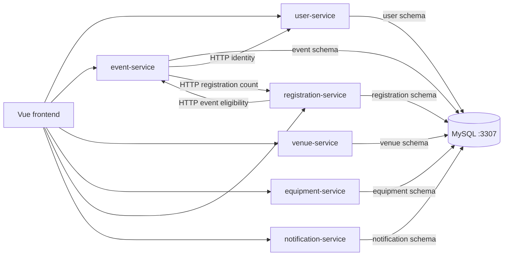

# ConnectSphere Data Model

Schema-per-service relational model for the Week 12 core features. One MySQL 8.4 instance runs locally in Docker Compose and contains six service-owned schemas. Services never join across schemas; they share IDs over HTTP. Cross-service keys (`event_id`, `user_id`, `venue_id`, `equipment_id`) are **logical foreign keys** only.

Column names in MySQL are **snake_case**. API JSON stays **camelCase**. SQLAlchemy maps between them.

Alembic migration heads define the deployed database structure. Status columns are plain `VARCHAR` fields; the listed values describe values currently written or reserved by the model, not database-enforced enums.

Out of scope for this schema: programme/sessions, comments, documents, reports, technical-staff assignment.

## Service to schema

| Service | Schema | Host port |
|---|---|---|
| user-service | `user` | 3307 |
| event-service | `event` | 3307 |
| venue-service | `venue` | 3307 |
| equipment-service | `equipment` | 3307 |
| registration-service | `registration` | 3307 |
| notification-service | `notification` | 3307 |

```mermaid
flowchart LR
  Vue[Vue frontend] --> UserSvc[user-service]
  Vue --> EventSvc[event-service]
  Vue --> VenueSvc[venue-service]
  Vue --> EquipSvc[equipment-service]
  Vue --> RegSvc[registration-service]
  Vue --> NotifSvc[notification-service]
  UserSvc -->|"user schema"| MySQL[(MySQL :3307)]
  EventSvc -->|"event schema"| MySQL
  VenueSvc -->|"venue schema"| MySQL
  EquipSvc -->|"equipment schema"| MySQL
  RegSvc -->|"registration schema"| MySQL
  NotifSvc -->|"notification schema"| MySQL
  EventSvc -->|"HTTP identity"| UserSvc
  EventSvc -->|"HTTP registration count"| RegSvc
  RegSvc -->|"HTTP event eligibility"| EventSvc
```

---

## 1. user-service (`user`)

### organisations

Lightweight client record. Multiple event organisers may belong to the same organisation.

| Column | Type | Notes |
|---|---|---|
| organisation_id | VARCHAR(64) PK | |
| name | VARCHAR(255) | |
| created_at | DATETIME | |

### users

| Column | Type | Notes |
|---|---|---|
| user_id | VARCHAR(64) PK | |
| email | VARCHAR(255) unique | Login username |
| display_name | VARCHAR(255) | |
| role | VARCHAR(64) | See roles below |
| organisation_id | VARCHAR(64) nullable | FK → organisations |
| department | VARCHAR(255) nullable | Internal staff |
| phone | VARCHAR(64) nullable | |
| communication_preferences | JSON nullable | |
| firebase_uid | VARCHAR(128) nullable | Links to the Firebase Auth account |
| created_at | DATETIME | |
| updated_at | DATETIME | |

Authentication is handled by Firebase. The former `password_hash` column was removed by the current user-service migration head.

**Roles** (stored values match the existing frontend session keys):

- `organiser` — Event Organiser
- `coordinator` — Event Coordinator
- `venue` — Venue Staff
- `techsupport` — Technical Support Staff
- `attendee` — Attendee

---

## 2. event-service (`event`)

Owns the event request record, review, assignment, change requests, and status history. The current API creates and reads events, assigns coordinators, resolves organiser identity through user-service, and obtains registration counts from registration-service. Review, status-transition, edit, and change-request APIs are not implemented yet.

### events

Lifecycle state is stored in `status`, not a separate table.

| Column | Type | Notes |
|---|---|---|
| event_id | VARCHAR(64) PK | |
| organiser_id | VARCHAR(64) | Logical FK → users |
| organisation_id | VARCHAR(64) nullable | Logical FK → organisations |
| coordinator_id | VARCHAR(64) nullable | Logical FK → users; null until assigned |
| name | VARCHAR(255) | |
| purpose | TEXT | |
| description | TEXT | |
| category | VARCHAR(64) nullable | |
| proposed_start_at | DATETIME | |
| proposed_end_at | DATETIME | |
| expected_attendance | INT | |
| venue_requirements | TEXT | |
| accessibility_needs | TEXT | |
| equipment_requirements | TEXT | |
| layout_preference | VARCHAR(64) nullable | The event's required layout |
| internal_notes | TEXT nullable | SPM-71: staff only; never on the shared event read |
| organiser_contact | VARCHAR(255) nullable | SPM-71 |
| registration_enabled | BOOLEAN | |
| registration_opens_at | DATETIME nullable | |
| registration_closes_at | DATETIME nullable | |
| capacity | INT | Intended registration cap |
| status | VARCHAR(32) | See statuses below |
| submitted_at | DATETIME nullable | |
| created_at | DATETIME | |
| updated_at | DATETIME | |

**Event status:** the create API currently writes `created`; seed data also uses `planning` and `confirmed`. Other lifecycle values are not validated or transitioned by the current service. Approving a request (SPM-69) moves it from `under review` or `changes requested` to `planning`, written to `event_status_history`. Raising a clarification (SPM-68) moves `under review` to `changes requested`, and resolving the last open one moves it back.

**Registration settings (SPM-90, `PATCH /events/{id}/registration-settings`):** the assigned coordinator sets `registration_enabled`, `registration_opens_at`, `registration_closes_at`, and `capacity` while the event is `approved`, `planning`, `preparing`, `prepared`, `confirmed`, or `reconsidering`. The close must be after the open and no later than `proposed_start_at`. `capacity` cannot go below the attendees currently registered in registration-service. If it exceeds what a venue booking with status `approved` holds in the event's `layout_preference`, the coordinator must confirm the change; the venue's largest layout applies when there is no layout match. The coordinator must also confirm turning registration off while attendees are registered. Existing registrations are left as they are, and the attendees are notified. Each changed setting is written to `event_field_changes`.

New API-created events have `submitted_at = NULL`. Event editing, submission, and status-history writes are not currently implemented.

**Coordinator edits (SPM-71, `PATCH /events/{id}`):** only the assigned coordinator (`coordinator_id`) may edit, and not while the event is `completed`, `cancelled`, `rejected`, `draft`, or `discarded`. `name`, `description`, `purpose`, `category`, `internal_notes`, and `organiser_contact` save quietly. `proposed_start_at`, `proposed_end_at`, `expected_attendance`, `layout_preference`, `accessibility_needs`, and `equipment_requirements` are significant. A significant change on an event with an `approved` venue booking or an `active`/`reserved` equipment reservation, or on a `confirmed` event, is refused until the coordinator confirms it. Once confirmed, those bookings and reservations get `needs_reverification`, and a `confirmed` event moves to `reconsidering` (written to `event_status_history`). Each changed field is written to `event_field_changes`.

### event_reviews

| Column | Type | Notes |
|---|---|---|
| review_id | VARCHAR(64) PK | |
| event_id | VARCHAR(64) | FK → events |
| reviewer_id | VARCHAR(64) | Logical FK → users |
| action | VARCHAR(32) | `request_clarification` \| `approve` \| `reject` |
| comment | TEXT | The clarification's question, or the decision note |
| created_at | DATETIME | |
| field | VARCHAR(64) nullable | SPM-68: the event request field a clarification concerns |
| status | VARCHAR(16) nullable | SPM-68: `open` \| `resolved` on clarifications; null on decisions |
| resolved_by | VARCHAR(64) nullable | SPM-68: logical FK → users |
| resolved_at | DATETIME nullable | SPM-68 |

**Approval (SPM-69, `POST /events/{id}/approve`):** each approval adds an `approve` row: `reviewer_id` is the deciding coordinator, `comment` is their optional note to the organiser, and `created_at` is when they decided. The latest `approve` or `reject` row is what `GET /events/{id}/decision` returns. The `event_status_history` row for the approval does not carry the note. Rejection does not write rows here yet.

**Clarifications (SPM-68, `POST /events/{id}/clarifications`):** each clarification is a `request_clarification` row raised by the assigned coordinator (`reviewer_id`), with its question in `comment`, an optional `field`, and `status` `open` until that coordinator resolves it (`resolved_by`, `resolved_at`). Raising one moves a request that is `under review` to `changes requested`. Once no row for the event is `open`, a `changes requested` event returns to `under review`. Both moves are written to `event_status_history`, but the question itself is not. Drafts cannot take one. Migration `0004` marked every clarification that existed before it as `open`.

### event_clarification_replies

SPM-68 AC3: the replies in a clarification thread.

| Column | Type | Notes |
|---|---|---|
| reply_id | VARCHAR(64) PK | |
| review_id | VARCHAR(64) | FK → event_reviews (a `request_clarification` row) |
| author_id | VARCHAR(64) | Logical FK → users |
| author_role | VARCHAR(32) | `organiser` \| `coordinator`: the role they replied as |
| message | TEXT | |
| created_at | DATETIME | |

The organiser who filed the event, a colleague in their organisation, or the assigned coordinator can reply while the clarification is open.

### event_assignments

Coordinator assign / reassign history.

| Column | Type | Notes |
|---|---|---|
| assignment_id | VARCHAR(64) PK | |
| event_id | VARCHAR(64) | FK → events |
| coordinator_id | VARCHAR(64) | Logical FK → users |
| assigned_by | VARCHAR(64) | Logical FK → users |
| assigned_at | DATETIME | |

**Assignment rules (SPM-66, `POST /events/{id}/assign-coordinator`):** any Event Coordinator may assign or reassign an event to an Event Coordinator (the assignee's role is checked against user-service). No workload limit applies. Events that are `completed`, `cancelled`, `rejected`, `draft`, or `discarded` cannot be assigned. Each assignment adds a row here and sets `events.coordinator_id`. A `submitted` event moves to `under review` (written to `event_status_history`). These rows appear in the activity log as `assignment` entries, whose previous coordinator comes from the row before.

### event_change_requests

| Column | Type | Notes |
|---|---|---|
| change_request_id | VARCHAR(64) PK | |
| event_id | VARCHAR(64) | FK → events |
| requested_by | VARCHAR(64) | Logical FK → users |
| status | VARCHAR(32) | `pending` \| `withdrawn` \| `accepted` \| `declined`; seed rows also use `applied` |
| summary | TEXT | The organiser's reason for the change |
| proposed_changes | JSON nullable | Field → proposed value (datetimes as ISO strings, naive UTC) |
| current_values | JSON nullable | SPM-106: field → value when the request was raised |
| affects_venue | BOOLEAN | Start, end, attendance, layout, or accessibility changes |
| affects_equipment | BOOLEAN | Start, end, or equipment requirements change |
| affects_registration | BOOLEAN | Start, end, or attendance changes |
| reviewed_by | VARCHAR(64) nullable | Who closed it: the deciding coordinator, or the organiser who withdrew |
| reviewed_at | DATETIME nullable | When it was closed |
| decision_reason | TEXT nullable | SPM-106: the coordinator's reason, shown to the organiser |
| created_at | DATETIME | |

**Change requests (SPM-106, `POST /events/{id}/change-requests`):** the organiser who filed the event, or a colleague in their organisation, can request a change while the event is `under review`, `changes requested`, `approved`, `planning`, `preparing`, `prepared`, `confirmed`, or `reconsidering`. Drafts are edited directly, a `submitted` request has no coordinator yet, and finished events take none. Changeable fields are the name, description, purpose, category, start and end, expected attendance, layout, accessibility needs, and equipment requirements. Only fields whose proposed value differs are stored, and a reason is required. An event can have only one `pending` request. The event is untouched while one is pending. Only the organiser who raised a request can withdraw it. The assigned coordinator accepts or declines it; declining needs a reason. Accepting applies the proposed values with the SPM-71 edit rules, which write `event_field_changes`, flag arrangements, and move a confirmed event to `reconsidering`. The `0005` migration added `current_values` and `decision_reason`.

### event_status_history

| Column | Type | Notes |
|---|---|---|
| history_id | VARCHAR(64) PK | |
| event_id | VARCHAR(64) | FK → events |
| from_status | VARCHAR(32) nullable | |
| to_status | VARCHAR(32) | |
| changed_by | VARCHAR(64) | Logical FK → users |
| note | TEXT | |
| created_at | DATETIME | |

Seed data writes initial history records; current API operations do not write status history.

### event_field_changes

SPM-71: one row per field a coordinator edits. `GET /events/{id}/activity-log` merges these (`kind: edit`) with `event_status_history` (`kind: status`), oldest first.

| Column | Type | Notes |
|---|---|---|
| change_id | VARCHAR(64) PK | |
| event_id | VARCHAR(64) | FK → events |
| field | VARCHAR(64) | API field name, e.g. `expectedAttendance` |
| old_value | TEXT nullable | Previous value as text; datetimes in ISO 8601 |
| new_value | TEXT nullable | New value as text |
| changed_by | VARCHAR(64) | Logical FK → users |
| created_at | DATETIME | |

---

## 3. venue-service (`venue`)

### venues

Venue Staff create, edit, and retire venues (SPM-60); coordinators, venue staff, and technical support can read them. Retiring sets `is_active` to false and never deletes the row, so booking history keeps resolving. Overall capacity is not stored: the API returns the highest layout capacity (SPM-60 AC3). No filtering API uses `JSON_CONTAINS` yet.

| Column | Type | Notes |
|---|---|---|
| venue_id | VARCHAR(64) PK | |
| code | VARCHAR(64) | Catalogue code, e.g. `MH-A` |
| name | VARCHAR(255) | |
| location | VARCHAR(255) | Building or complex |
| address | VARCHAR(255) | Full street address |
| floor | VARCHAR(64) | |
| description | TEXT | |
| facilities | JSON | Array of strings |
| accessibility | JSON | Array of strings |
| layouts | JSON | Array of `{name, capacity}`; capacity must be at least 1 |
| operating_hours | JSON | Array of `{day, opens, closes}`: day `Mon` to `Sun`, times `HH:MM` read as UTC |
| setup_minutes | INT | Whole minutes of preparation before a booking. Required, zero or greater (SPM-110) |
| turnaround_minutes | INT | Whole minutes of reset after a booking. Required, zero or greater (SPM-110) |
| is_active | BOOLEAN | False once retired |
| created_at | DATETIME | |

### venue_activity_log

One row per create, update, or retire (SPM-60 AC9), shown in the catalogue's activity log with times in UTC.

| Column | Type | Notes |
|---|---|---|
| log_id | VARCHAR(64) PK | |
| venue_id | VARCHAR(64) | FK → venues |
| action | VARCHAR(32) | `created` \| `updated` \| `retired` |
| changed_by | VARCHAR(64) | Logical FK → users |
| changed_by_name | VARCHAR(255) | Name at the time of the change |
| changed_by_role | VARCHAR(64) | Role at the time of the change |
| changes | JSON | Only what changed, e.g. `{"turnaroundMinutes": {"old": 45, "new": 60}}` |
| created_at | DATETIME | UTC |

### venue_unavailability

Stores maintenance and blocked periods.

| Column | Type | Notes |
|---|---|---|
| unavailability_id | VARCHAR(64) PK | |
| venue_id | VARCHAR(64) | FK → venues |
| starts_at | DATETIME | |
| ends_at | DATETIME | |
| reason | TEXT | |
| created_by | VARCHAR(64) | Logical FK → users |
| created_at | DATETIME | |

The suitability check (SPM-62) reads this table: an overlapping period makes a venue not suitable. There is no router yet for recording a period.

### venue_bookings

| Column | Type | Notes |
|---|---|---|
| booking_id | VARCHAR(64) PK | |
| venue_id | VARCHAR(64) | FK → venues |
| event_id | VARCHAR(64) | Logical FK → events |
| requested_by | VARCHAR(64) | Logical FK → users |
| status | VARCHAR(32) | `pending` \| `approved` \| `rejected` \| `withdrawn` \| `cancelled` |
| starts_at | DATETIME | Event window start |
| ends_at | DATETIME | Event window end |
| setup_starts_at | DATETIME | SPM-64: start of the occupied window, `starts_at` minus the venue's setup time; set by the server on request and approval |
| teardown_ends_at | DATETIME | SPM-64: end of the occupied window, `ends_at` plus the venue's turnaround time |
| requirements_snapshot | TEXT | |
| event_snapshot | JSON nullable | SPM-63: the event's facts when the request was sent (name, client organisation, times, attendance, layout, accessibility needs, required facilities) |
| coordinator_notes | TEXT nullable | SPM-63: the coordinator's notes for Venue Staff |
| warnings | JSON nullable | SPM-63: suitability warnings the coordinator acknowledged, shown to Venue Staff |
| needs_reverification | BOOLEAN | SPM-71: default false. Set on `approved` bookings when a significant event change is saved; the status stays `approved`, so the venue stays held |
| reverification_note | TEXT nullable | SPM-71: what changed on the event |
| decision_reason | TEXT nullable | |
| reviewed_by | VARCHAR(64) nullable | |
| reviewed_at | DATETIME nullable | |
| created_at | DATETIME | |

Index: `(venue_id, starts_at, ends_at)`.

**Conflict rule (SPM-64, `app/services/occupancy.py`):** a booking occupies its venue from `starts_at` minus the venue's `setup_minutes` to `ends_at` plus its `turnaround_minutes`. Two `approved` rows for the same venue may never have overlapping windows; windows that only touch are fine, but event times that only touch can still clash. An unavailability period overlapping the window also conflicts. `pending` rows never block; they only warn. Search, suitability, and approval all use this one rule. The database enforces it too: triggers `venue_bookings_no_overlap_insert` and `venue_bookings_no_overlap_update` (migration `e7b2c4d91f03`) lock the venue's row and refuse (SQLSTATE 45000) any write that would make an overlapping `approved` row, so two simultaneous approvals cannot both pass. Creating the triggers needs `--log-bin-trust-function-creators=1`, set in `infra/docker-compose.yml`.

**Suitability rule (SPM-62, `POST /venues/suitability`, `app/services/suitability.py`):** failures are attendance above the capacity of the required layout (or the venue's capacity if no layout is given), an unsupported layout, a missing required facility or accessibility feature, a time outside operating hours (hours are read as UTC), and an approved booking of another event or an unavailability period overlapping the occupied window (SPM-64 rule above). Warnings are attendance above 90% of that capacity and an overlapping pending booking of another event. Any failure gives `not suitable`; only warnings give `suitable with warnings`. Values not in the request come from the event record.

**Booking request rules (SPM-63, `POST /venues/bookings`):** only the coordinator assigned to the event may request a venue, and only while the event is `approved` or `planning`. The suitability rule runs first: any failure refuses the request (409, with the failures), and warnings refuse it unless `acknowledgeWarnings` is true, in which case they are stored in `warnings`. An event may have only one `pending` request; the coordinator who sent it can withdraw it (`withdrawn`), after which it no longer counts in suitability checks. Venue Staff are notified of each request and withdrawal (best effort through notification-service). Requests are listed oldest first.

Approval enforces the conflict rule (SPM-64). Booking requests no longer take setup and teardown times from the caller: the server derives the occupied window from the venue's setup and turnaround times (the Week 7 customer change, which replaced the earlier answer that turnaround need not be considered). The review flow moves a pending booking to `approved` or `rejected`. A `withdrawn`, `rejected`, or `cancelled` row no longer holds the venue, so its period is free again (SPM-64 AC8); SPM-114's `POST /venues/bookings/release` (for event cancellation) and `POST /venues/bookings/{id}/cancel` set `cancelled`.

---

## 4. equipment-service (`equipment`)

Quantity-based availability. Catalogue counts live on `equipment_info`. `equipment_units` still stores one row per physical unit. Technical support can create and update a catalogue record. Availability for a period is serviceable quantity minus overlapping active reservations. A check for an event reports each open request line against that line's period and does not create a reservation. A save that drops serviceable quantity below reserved stock returns 409 until the caller acknowledges it. Quantity and out-of-service edits are written to `equipment_activity_log`.

### equipment_info

| Column | Type | Notes |
|---|---|---|
| equipment_id | VARCHAR(64) PK | |
| code | VARCHAR(64) unique | Catalogue code. Existing rows are backfilled from `equipment_id` |
| name | VARCHAR(255) | |
| category | VARCHAR(64) | |
| description | TEXT | |
| location | VARCHAR(255) | Original store column. Kept so current reads and seed still work |
| home_location | VARCHAR(255) | SPM-75 home location. Existing rows are backfilled from `location` |
| technical_notes | TEXT | Optional technical notes |
| total_quantity | INT | Owned quantity |
| damaged_count | INT | Out of service, still owned |
| maintenance_count | INT | Out of service, still owned |
| retired_count | INT | Out of service, still owned |

### equipment_units

| Column | Type | Notes |
|---|---|---|
| unit_id | VARCHAR(64) PK | |
| equipment_id | VARCHAR(64) | FK → equipment_info |
| status | VARCHAR(32) | `available` \| `maintenance` \| `damaged` |

The catalogue API derives one coarse equipment status: `maintenance` if any unit is under maintenance, otherwise `damaged` if any unit is damaged, otherwise `available`. Unit-management endpoints are not implemented. Out-of-service counts on `equipment_info` are separate from these unit rows. `retired` is a count, not a unit status.

### equipment_activity_log

One row per catalogue change. Nothing writes this table yet. SPM-75 uses it for quantity and out-of-service edits.

| Column | Type | Notes |
|---|---|---|
| log_id | VARCHAR(64) PK | |
| equipment_id | VARCHAR(64) | FK → equipment_info |
| action | VARCHAR(32) | |
| changed_by | VARCHAR(64) | Logical FK → users |
| changed_by_name | VARCHAR(255) | |
| changed_by_role | VARCHAR(64) | |
| changes | JSON | Field diffs, including quantity and out-of-service counts |
| created_at | DATETIME | |

### equipment_requests

| Column | Type | Notes |
|---|---|---|
| request_id | VARCHAR(64) PK | |
| event_id | VARCHAR(64) | Logical FK → events |
| equipment_id | VARCHAR(64) | FK → equipment_info |
| quantity | INT | |
| technical_requirements | TEXT | |
| requested_by | VARCHAR(64) | Logical FK → users |
| status | VARCHAR(32) | `pending` \| `approved` \| `rejected` \| `unavailable` \| `cancelled` |
| starts_at | DATETIME | Caller-supplied request window |
| ends_at | DATETIME | |
| reviewed_by | VARCHAR(64) nullable | Technical support user who last acted |
| reviewed_at | DATETIME nullable | When that action was recorded |
| review_note | TEXT | |
| created_at | DATETIME | |

### equipment_reservations

Created only when the explicit reserve endpoint is called for an approved request. Approval and reservation are separate operations in the current implementation.

| Column | Type | Notes |
|---|---|---|
| reservation_id | VARCHAR(64) PK | |
| request_id | VARCHAR(64) | FK → equipment_requests |
| event_id | VARCHAR(64) | Logical FK → events |
| equipment_id | VARCHAR(64) | FK → equipment_info |
| quantity | INT | |
| starts_at | DATETIME | |
| ends_at | DATETIME | |
| status | VARCHAR(32) | `active` \| `released` |
| needs_reverification | BOOLEAN | SPM-71: default false. Set on `active`/`reserved` reservations when a significant event change is saved; the status is unchanged, so the stock stays held |
| reverification_note | TEXT nullable | SPM-71: what changed on the event |

The reserve operation refuses a quantity above what is serviceable in that period, and refuses a second reservation for the same request. Releasing a reservation sets its status to `released`, which returns that quantity to later availability checks. Cancelling requests and reacting to event cancellation are not implemented.

---

## 5. registration-service (`registration`)

Event-service currently supplies registration-enabled, capacity, and open/close values over HTTP. Registration-service stores registration windows and sign-ups, but only uses the presence of a window row as a local gate; eligibility values are read from event-service.

### registration_windows

One per event. Current seed data creates these rows; automatic creation when an event is confirmed is not implemented.

| Column | Type | Notes |
|---|---|---|
| event_id | VARCHAR(64) PK | Logical FK → events; unique |
| capacity | INT | |
| opens_at | DATETIME | |
| closes_at | DATETIME | |

### attendee_registrations

| Column | Type | Notes |
|---|---|---|
| attendee_registration_id | VARCHAR(64) PK | |
| event_id | VARCHAR(64) | FK → registration_windows; also a logical FK → events |
| user_id | VARCHAR(64) nullable | Logical FK → users |
| attendee_name | VARCHAR(255) | |
| attendee_email | VARCHAR(255) | |
| status | VARCHAR(32) | API writes `registered`. Withdrawal sets `withdrawn` and keeps the row. `waitlisted` is reserved |
| created_at | DATETIME | |
| withdrawn_at | DATETIME nullable | Set when the row is withdrawn |

The current application rejects a duplicate email among rows whose status is `registered`. There is no database unique constraint or waitlist workflow. `POST /registrations/{id}/withdraw` is limited to the owning attendee, and only while the event has not started and is not completed or cancelled. Registering again creates a new row.

**Current capacity rule:** fetch the event over HTTP, require status `confirmed` and registration enabled, check the event’s open/close timestamps, then require the current count of `registered` rows to be below the event’s capacity. The check and insert are not protected by row locking, so concurrent requests can race.

---

## 6. notification-service (`notification`)

The schema contains persisted notification records, and seed data inserts one example. `POST /notifications` is an email stub accepting `to`, `subject`, and `body`; it prints the message and returns `queued`. `POST /notifications/records` stores a row for the signed-in user, or for `userId` when the caller is staff (coordinator, venue, techsupport); anyone else naming another user gets 403. `GET /notifications` returns only the caller's rows. Registration withdrawal writes one of these records, and so does a change to an event's registration settings (SPM-90): the organiser gets `event.registration_settings`, and registered attendees get `registration.closed` when registration is turned off. Mark-read is not implemented.

### notifications

| Column | Type | Notes |
|---|---|---|
| notification_id | VARCHAR(64) PK | |
| user_id | VARCHAR(64) | Logical FK → users |
| event_id | VARCHAR(64) nullable | Logical FK → events |
| type | VARCHAR(64) | Unrestricted string; seed data uses `event_confirmed` |
| title | VARCHAR(255) | |
| body | TEXT | |
| is_read | BOOLEAN | |
| created_at | DATETIME | |

Indexes: `user_id`; `created_at`.

---

## Logical ERD

Logical model of the whole system (Crow’s foot). Cross-service keys are logical FKs — there is no physical `FOREIGN KEY` across service schemas. `users.role` is a disjoint subtype: `organiser` | `coordinator` | `venue` | `techsupport` | `attendee`.

```mermaid
erDiagram
  organisations {
    string organisation_id PK
    string name
    datetime created_at
  }

  users {
    string user_id PK
    string email UK
    string display_name
    string role
    string organisation_id FK
    string department
    string phone
    json communication_preferences
    string firebase_uid
    datetime created_at
    datetime updated_at
  }

  events {
    string event_id PK
    string organiser_id FK
    string organisation_id FK
    string coordinator_id FK
    string name
    text purpose
    text description
    string category
    datetime proposed_start_at
    datetime proposed_end_at
    int expected_attendance
    text venue_requirements
    text accessibility_needs
    text equipment_requirements
    string layout_preference
    text internal_notes
    string organiser_contact
    boolean registration_enabled
    datetime registration_opens_at
    datetime registration_closes_at
    int capacity
    string status
    datetime submitted_at
    datetime created_at
    datetime updated_at
  }

  event_reviews {
    string review_id PK
    string event_id FK
    string reviewer_id FK
    string action
    text comment
    datetime created_at
  }

  event_assignments {
    string assignment_id PK
    string event_id FK
    string coordinator_id FK
    string assigned_by FK
    datetime assigned_at
  }

  event_change_requests {
    string change_request_id PK
    string event_id FK
    string requested_by FK
    string status
    text summary
    json proposed_changes
    boolean affects_venue
    boolean affects_equipment
    boolean affects_registration
    string reviewed_by FK
    datetime reviewed_at
    datetime created_at
  }

  event_status_history {
    string history_id PK
    string event_id FK
    string from_status
    string to_status
    string changed_by FK
    text note
    datetime created_at
  }

  event_field_changes {
    string change_id PK
    string event_id FK
    string field
    text old_value
    text new_value
    string changed_by FK
    datetime created_at
  }

  venues {
    string venue_id PK
    string code
    string name
    string location
    string address
    string floor
    text description
    json facilities
    json accessibility
    json layouts
    json operating_hours
    int setup_minutes
    int turnaround_minutes
    boolean is_active
    datetime created_at
  }

  venue_activity_log {
    string log_id PK
    string venue_id FK
    string action
    string changed_by FK
    string changed_by_name
    string changed_by_role
    json changes
    datetime created_at
  }

  venue_unavailability {
    string unavailability_id PK
    string venue_id FK
    datetime starts_at
    datetime ends_at
    text reason
    string created_by FK
    datetime created_at
  }

  venue_bookings {
    string booking_id PK
    string venue_id FK
    string event_id FK
    string requested_by FK
    string status
    datetime starts_at
    datetime ends_at
    datetime setup_starts_at
    datetime teardown_ends_at
    text requirements_snapshot
    json event_snapshot
    text coordinator_notes
    json warnings
    boolean needs_reverification
    text reverification_note
    text decision_reason
    string reviewed_by FK
    datetime reviewed_at
    datetime created_at
  }

  equipment_info {
    string equipment_id PK
    string code UK
    string name
    string category
    text description
    string location
    string home_location
    text technical_notes
    int total_quantity
    int damaged_count
    int maintenance_count
    int retired_count
  }

  equipment_activity_log {
    string log_id PK
    string equipment_id FK
    string action
    string changed_by FK
    string changed_by_name
    string changed_by_role
    json changes
    datetime created_at
  }

  equipment_units {
    string unit_id PK
    string equipment_id FK
    string status
  }

  equipment_requests {
    string request_id PK
    string event_id FK
    string equipment_id FK
    int quantity
    text technical_requirements
    string requested_by FK
    string status
    datetime starts_at
    datetime ends_at
    string reviewed_by FK
    text review_note
    datetime created_at
  }

  equipment_reservations {
    string reservation_id PK
    string request_id FK
    string event_id FK
    string equipment_id FK
    int quantity
    datetime starts_at
    datetime ends_at
    string status
    boolean needs_reverification
    text reverification_note
  }

  registration_windows {
    string event_id PK
    int capacity
    datetime opens_at
    datetime closes_at
  }

  attendee_registrations {
    string attendee_registration_id PK
    string event_id FK
    string user_id FK
    string attendee_name
    string attendee_email
    string status
    datetime created_at
    datetime withdrawn_at
  }

  notifications {
    string notification_id PK
    string user_id FK
    string event_id FK
    string type
    string title
    text body
    boolean is_read
    datetime created_at
  }

  organisations ||--o{ users : "has organisers"
  users ||--o{ events : organises
  users ||--o{ events : coordinates
  users ||--o{ event_reviews : reviews
  users ||--o{ event_assignments : "assigned as"
  users ||--o{ event_change_requests : requests
  users ||--o{ event_status_history : "changes status"
  users ||--o{ venue_bookings : "requests booking"
  users ||--o{ venue_unavailability : blocks
  users ||--o{ equipment_requests : "requests equipment"
  users ||--o{ attendee_registrations : registers
  users ||--o{ notifications : receives

  events ||--o{ event_reviews : has
  events ||--o{ event_assignments : has
  events ||--o{ event_change_requests : has
  events ||--o{ event_status_history : has
  events ||--o{ event_field_changes : has
  events ||--o{ venue_bookings : books
  events ||--o{ equipment_requests : needs
  events ||--o| registration_windows : opens
  events ||--o{ notifications : triggers
  events ||--o{ equipment_reservations : "reserved for"

  venues ||--o{ venue_bookings : receives
  venues ||--o{ venue_unavailability : "blocked by"
  venues ||--o{ venue_activity_log : "logs changes"

  equipment_info ||--o{ equipment_units : contains
  equipment_info ||--o{ equipment_activity_log : logs
  equipment_info ||--o{ equipment_requests : "requested as"
  equipment_info ||--o{ equipment_reservations : "committed from"
  equipment_requests ||--o| equipment_reservations : commits

  registration_windows ||--o{ attendee_registrations : accepts
```

## Schema ownership

Alembic revisions under each service are the source of truth. Docker init SQL only creates the six empty schemas and grants the application user access. After `docker compose up -d`, run `python scripts/migrate.py` (upgrade + seed). Do not use `create_all()` as the schema path.
